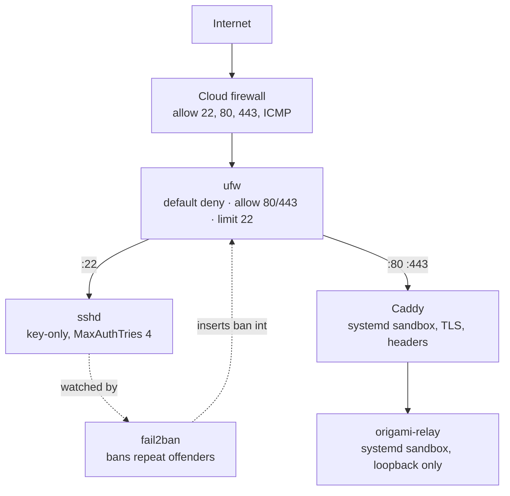

# Hardening a self-hosted Origami Remote relay

A recipe, in order. Each layer assumes the one before it can fail.



Apply top to bottom. Verify each layer before moving to the next.

---

## 1 — Cloud firewall

Set this in your provider's control panel, not on the box. A rule stored outside
the machine survives a compromise of the machine.

| Direction | Port | Why |
|---|---|---|
| Inbound | TCP 22 | admin access |
| Inbound | TCP 80 | Let's Encrypt HTTP-01 renewal — leave this open, always |
| Inbound | TCP 443 | the relay and the phone page |
| Inbound | ICMP | path MTU discovery, ping |
| Outbound | all | unrestricted |

Port 80 stays open even though nothing serves real traffic there. Caddy answers
the renewal challenge on it every sixty days or so. Close it and the certificate
expires silently — nothing fails until it does.

---

## 2 — ufw (the box's own firewall)

```bash
sudo ufw default deny incoming
sudo ufw default allow outgoing
sudo ufw allow 80/tcp
sudo ufw allow 443/tcp
sudo ufw limit 22/tcp
sudo ufw enable      # confirms with a prompt; type y
```

`limit` rate-limits SSH: roughly six connection attempts in thirty seconds trips
it, on a ROLLING window. A retry loop refreshes the window instead of clearing
it, so a script that keeps trying holds its own door shut.

- Batch remote admin work into ONE `ssh host 'cmd1; cmd2; cmd3'` call, not several short ones.
- If SSH stops answering right after a change, wait thirty seconds with ZERO attempts before the next one.
- Confirm the box is up over another port first: `curl -s -o /dev/null -w '%{http_code}' https://your-host/healthz`. `200` means only SSH is rate-limited, not the box.

---

## 3 — sshd: key-only

`/etc/ssh/sshd_config.d/10-hardening.conf`:

```
PasswordAuthentication no
KbdInteractiveAuthentication no
PermitEmptyPasswords no
MaxAuthTries 4
LoginGraceTime 30
AllowAgentForwarding no
AllowTcpForwarding no
X11Forwarding no
```

```bash
sudo sshd -t && sudo systemctl reload sshd
```

Add your public key to `~/.ssh/authorized_keys` and confirm a fresh key login
works in a SECOND session before you close the first one. A syntax error in the
drop-in, caught after the only open session is gone, means console recovery
through the provider.

Restricting logins to one named account (`AllowUsers <your-admin-user>`) is worth
adding once you know which account you actually use — leave it out until then, or
a typo locks out the only account that can fix it.

---

## 4 — fail2ban

```bash
sudo apt install -y fail2ban
```

`/etc/fail2ban/jail.local`:

```ini
[DEFAULT]
backend = systemd

[sshd]
enabled = true
maxretry = 5
findtime = 15m
bantime = 30m
bantime.increment = true
bantime.factor = 2
bantime.maxtime = 2d
```

Every number above is an EXAMPLE, not a recommendation, and deliberately not
the value any particular server runs. Choose your own `maxretry`, `findtime`
and `bantime` — publishing the real ones tells an attacker exactly how much
probing a host absorbs before it reacts.

```bash
sudo systemctl restart fail2ban
```

**`backend = systemd` changes what the filter sees.** `journalctl -o cat` prints
the bare message (`Invalid user rian from 1.2.3.4 port 48286`); the systemd
backend hands the filter a rebuilt syslog-style line with a host and a
`sshd-session[pid]:` prefix instead. A custom filter anchored on the bare message
matches thousands of lines against a `journalctl` dump and zero through the real
backend — and nothing in `fail2ban-client status` tells them apart. The shipped
`sshd` filter already accounts for this; verify it anyway, every time the filter
changes:

```bash
sudo fail2ban-regex systemd-journal /etc/fail2ban/filter.d/sshd.conf
```

Check the `Failregex: N total` line is non-zero. Then prove the ban path
separately, with an address that can never be real (RFC 5737 TEST-NET, safe to
use anywhere):

```bash
sudo fail2ban-client set sshd banip 192.0.2.1
sudo fail2ban-client get sshd banip --with-time
sudo fail2ban-client set sshd unbanip 192.0.2.1
```

A regex match and a working ban are two separate claims. A jail can report
healthy status and ban nobody.

---

## 5 — keep it patched

```bash
sudo apt install -y unattended-upgrades
```

`/etc/apt/apt.conf.d/50unattended-upgrades`:

```
Unattended-Upgrade::Remove-Unused-Dependencies "true";
Unattended-Upgrade::Automatic-Reboot "true";
Unattended-Upgrade::Automatic-Reboot-WithUsers "true";
Unattended-Upgrade::Automatic-Reboot-Time "03:30";
```

Security patches that install themselves and never reboot leave a patched kernel
on disk while the vulnerable one keeps running. Set `Automatic-Reboot-WithUsers` to `true` only if you accept a reboot while
someone is logged in; the default waits for an empty login list, which on a
server you rarely log in to is usually the right choice.

---

## 6 — systemd sandbox: the relay unit

`origami-relay.service`, shipped in this kit, already carries the baseline:

```
NoNewPrivileges=true
PrivateTmp=true
PrivateDevices=true
ProtectSystem=strict
ProtectHome=true
ProtectKernelTunables=true
ProtectKernelModules=true
ProtectControlGroups=true
RestrictAddressFamilies=AF_INET AF_INET6
RestrictNamespaces=true
LockPersonality=true
MemoryDenyWriteExecute=false
ReadOnlyPaths=/opt/origami
```

Two lines are deliberate exceptions, not oversights:

- **`MemoryDenyWriteExecute=false`.** The relay binary is a Bun runtime, which
  JIT-compiles. Setting this `true` breaks the process outright.
- **`SystemCallFilter` is not set.** It is the single biggest remaining
  contributor to the unit's security score, and the one most likely to fail
  subtly: a syscall filter that is slightly too tight passes a health check and
  breaks a real connection under load, hours later. Test a filter thoroughly on
  a non-production copy before shipping it here.

Push further by clearing the capability set the unit inherits by default. The
relay binds only loopback high ports — it needs none of it.

`/etc/systemd/system/origami-relay.service.d/hardening.conf`:

```ini
[Service]
AmbientCapabilities=
CapabilityBoundingSet=
```

An EMPTY assignment matters here. systemd list-settings like these normally
APPEND to what the base unit already granted; writing the key with nothing after
it clears that list first, so the two lines above leave the process with no
capabilities at all rather than merging onto the default set.

```bash
sudo systemctl daemon-reload
sudo systemctl restart origami-relay
```

---

## 7 — systemd sandbox: Caddy

The packaged Caddy unit ships broader capabilities than a reverse proxy in front
of one loopback service needs — including the ability to reconfigure the
network stack, which a compromised web server holding it could use against the
firewall meant to contain it.

`/etc/systemd/system/caddy.service.d/hardening.conf`:

```ini
[Service]
AmbientCapabilities=
CapabilityBoundingSet=
AmbientCapabilities=CAP_NET_BIND_SERVICE
CapabilityBoundingSet=CAP_NET_BIND_SERVICE
NoNewPrivileges=true
ProtectSystem=strict
ProtectHome=true
PrivateTmp=true
ReadWritePaths=/var/lib/caddy
```

Same rule as the relay: clear both lists first, then grant back only
`CAP_NET_BIND_SERVICE` — the one thing Caddy needs, to hold port 443 without
running as root. `/etc/caddy` stays read-only: Caddy reads its config and
never writes it, and a proxy that cannot rewrite its own config is one less
thing a compromised process can turn against you.

Optional, recommended: close Caddy's admin API. It listens on loopback with
no authentication, so any local process could reconfigure the proxy. Add to
the top of the `Caddyfile`:

```
{
    admin off
}
```

After that `systemctl reload caddy` no longer works; use
`systemctl restart caddy` (about one second of TLS interruption).

```bash
sudo systemctl daemon-reload
sudo systemctl restart caddy
```

**`ProtectSystem=strict` makes almost everything read-only, including the
certificate store — prove the one path it must still write survives, with a
control that proves the sandbox is doing anything at all:**

```bash
# control: same write, WITHOUT the writable-path grant — must FAIL
sudo systemd-run --pipe --property=ProtectSystem=strict \
  bash -c 'touch /var/lib/caddy/probe && echo wrote'

# with the grant this unit actually uses — must SUCCEED
sudo systemd-run --pipe --property=ProtectSystem=strict \
  --property=ReadWritePaths=/var/lib/caddy \
  bash -c 'touch /var/lib/caddy/probe && echo wrote && rm /var/lib/caddy/probe'
```

Skip the control and a sandbox that never actually applied looks identical to
one that passed. Renewal that fails silently under `ProtectSystem=strict` does
not surface until the certificate expires, months later.

---

## 8 — the phone page's headers

Add this `header` block to the `Caddyfile` supplied with this kit, alongside the
one it already ships:

```
header {
    Content-Security-Policy "default-src 'self'; connect-src 'self'; frame-ancestors 'none'; base-uri 'none'; script-src 'self' 'unsafe-inline'"
    X-Frame-Options "DENY"
    Permissions-Policy "camera=(), microphone=(), geolocation=()"
}
```

**`connect-src 'self'` is the one that matters.** The page reads its own relay
address from `location.origin` and never needs to reach anywhere else. Pinning
`connect-src` to `'self'` means a tampered or injected script cannot send the
pairing key to a different origin, even if it runs.

- `frame-ancestors 'none'` and `X-Frame-Options: DENY` — the page cannot be framed by another site.
- `base-uri 'none'` — a script cannot rewrite `<base>` to redirect the page's own asset loads elsewhere.
- `script-src` keeps `'unsafe-inline'` because the shipped phone shell has one inline script block. Removing it needs a content hash tracked in lockstep with every deploy of the shell — do that once the shell's build stops changing shape often.

```bash
sudo systemctl reload caddy
curl -sI https://relay.example.com/app/ | grep -i content-security-policy
```

---

## Verify it all

```bash
sshd -T | grep -i password
sudo fail2ban-client status sshd
sudo ufw status verbose
systemd-analyze security origami-relay.service
systemd-analyze security caddy.service
```

Then, from a DIFFERENT machine — a local pass can hide a firewall or DNS problem
the phone would actually hit:

```bash
curl -fsS https://relay.example.com/healthz
curl -sI  https://relay.example.com/app/
curl -s -o /dev/null -w '%{http_code}\n' http://relay.example.com/    # expect a redirect, not a hang
```

`systemd-analyze security` scores are dominated by the standard switches above,
so the rough size of the drop repeats on a fresh box even though the exact
numbers vary by distribution and package version:

| Unit | Before | After |
|---|---|---|
| Caddy (packaged unit → sandbox drop-in) | 8.8 EXPOSED | 1.6 OK |
| origami-relay (kit unit → capabilities cleared) | 5.8 MEDIUM | 2.9 OK |
| sshd | ~9.6 UNSAFE | ~9.6 UNSAFE — expected, not fixable; sshd must spawn logins as any user |

sshd's number does not move. Ignore it.
