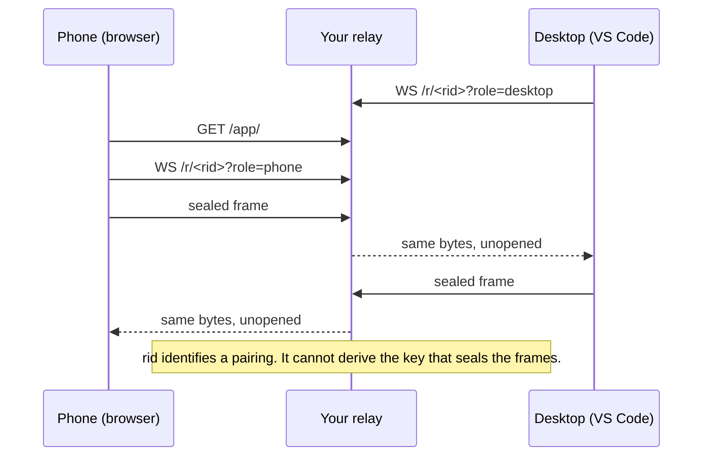

# Run your own Origami Remote relay

Ten minutes on a small server. A phone reaches a desktop through a machine you own.

This folder is the whole kit. It is self-contained: published as its own
repository, `origami-relay`, with no path back into the Origami Coder source.

---

## What a relay is

- A phone is on a mobile network. A desktop is behind a home router. Neither can dial the other.
- A relay is a third machine both sides can reach. It copies bytes between them.
- The Origami relay does that and nothing more: no accounts, no storage, no plaintext.



| The relay sees | The relay does not see |
|---|---|
| A random pairing id, connect/disconnect times, frame count and padded size | Prompts, replies, file paths, diffs, tool names, repo names, model names, who you are |

There is no sign-in. Nothing ties a pairing to a person.

---

## What you need

- A server with a public IPv4 address. The relay is a socket switch: 1 shared vCPU
  and 1 GB of memory are enough. Use fixed-price billing — a relay holds long
  connections, and per-GB pricing makes the bill hard to predict.
- A name you control, for example `relay.example.com`.
- Port 443 open to the internet. That is the only port the phone uses.
- Ubuntu 24.04 (or Debian 12) for `install.sh`. Any Linux works if you write the unit file by hand.

---

## Step 1 — point a name at the server

```
A    relay.example.com    <your server's public IPv4>
```

Wait for `dig +short relay.example.com` to answer with that address before Step 2.

---

## Step 2 — get the two pieces onto the server

Both come from this repository's **Releases** page. One release per Origami Code
version; take the newest.

| Asset | Holds | Goes to |
|---|---|---|
| `linux-x64.tar.gz` / `linux-arm64.tar.gz` | one file, `origami` — the relay and the engine in one binary | `ORIGAMI_RELEASE_URL` |
| `remote-app.tar.gz` | the phone shell: `remote/` with `index.html`, `remote.js`, `remote.css`, `chat.js`, the icon, the webmanifest | `APP_SRC` |

```bash
cd /root
curl -fsSLO https://github.com/PassingByPixels/origami-relay/releases/download/<tag>/remote-app.tar.gz
tar -xzf remote-app.tar.gz          # creates /root/remote
```

The shell must match the extension version that pairs to it; when the extension
updates, take the matching release and re-run Step 3.

> The shell and the sockets must be served from the SAME host name. The page reads
> its relay address from `location.origin`. Split them across two hosts and pairing
> fails with no error message.


---

## Step 3 — install

```bash
sudo ORIGAMI_RELEASE_URL="https://github.com/PassingByPixels/origami-relay/releases/download/<tag>/linux-x64.tar.gz" \
     ORIGAMI_RELEASE_SHA256="<the line for that asset in SHA256SUMS.txt>" \
     APP_SRC=/root/remote \
     ./install.sh
```

Use `linux-arm64.tar.gz` on an ARM server.

**Pin the tag.** `download/<tag>` fixes the version you reviewed;
`latest/download` silently follows whatever is published next.

**The checksum is required.** Every release carries a `SHA256SUMS.txt` with
one line per asset. Paste the line for the archive you named — the whole line
works, and case and spacing do not matter. `install.sh` checks it before it
unpacks anything and stops on a mismatch.

To install without that check, set `ORIGAMI_ALLOW_UNVERIFIED=1` and leave the
checksum empty. It is a separate variable on purpose: an unset checksum is
almost always a wrapper script whose variable did not expand, not a decision,
and that failure is invisible in a log.

What it does and does not do: it catches a corrupted or swapped download. It
cannot catch a bad release published from a compromised account, because the
same account writes `SHA256SUMS.txt`.

The script:

1. creates a system user `origami` that cannot log in,
2. unpacks the binary to `/opt/origami/bin/origami`,
3. copies the phone shell to `/opt/origami/remote-app`,
4. writes `origami-relay.service` to systemd, enables it, starts it.

Run it again to upgrade — same command, new `ORIGAMI_RELEASE_URL` and/or `APP_SRC`.

```bash
curl -fsS http://127.0.0.1:8787/healthz     # prints: ok
systemctl status origami-relay
```

Variables you can set in front of the command: `RELAY_USER`, `PREFIX`, `PORT`,
`BIND`, `DAILY_BUDGET_MB`.

---

## Step 4 — TLS

A phone browser refuses WebCrypto on plain `http`. Reach the relay over `https` and
`wss`. Pick ONE of the two ways below.

### The easy way: Caddy in front (recommended)

Caddy gets and renews the certificate on its own. It is not in Ubuntu's default
repositories — add the official one first.

```bash
sudo apt install -y debian-keyring debian-archive-keyring apt-transport-https curl
curl -1sLf 'https://dl.cloudsmith.io/public/caddy/stable/gpg.key' \
  | sudo gpg --dearmor -o /usr/share/keyrings/caddy-stable-archive-keyring.gpg
curl -1sLf 'https://dl.cloudsmith.io/public/caddy/stable/debian.deb.txt' \
  | sudo tee /etc/apt/sources.list.d/caddy-stable.list
sudo apt update
sudo apt install -y caddy
sudo cp Caddyfile /etc/caddy/Caddyfile
sudoedit /etc/caddy/Caddyfile      # replace relay.example.com with your host
sudo systemctl reload caddy
```

The relay stays on loopback. Caddy holds port 443. WebSockets need no extra
directive — `reverse_proxy` upgrades them — but the read/write timeouts are set to
0 in the supplied file, because a paired phone holds one socket open for hours.

### The direct way: the relay holds the certificate

Use this only to avoid a second program on the box.

```bash
sudo apt install -y certbot
sudo certbot certonly --standalone -d relay.example.com
```

Edit `/etc/systemd/system/origami-relay.service` so `ExecStart` reads:

```
ExecStart=/opt/origami/bin/origami relay --hostname 0.0.0.0 --port 443 --tls-cert /etc/letsencrypt/live/relay.example.com/fullchain.pem --tls-key /etc/letsencrypt/live/relay.example.com/privkey.pem --app-dir /opt/origami/remote-app --daily-budget-mb 2048
```

Add this line under `[Service]` — a non-root process cannot bind 443:

```
AmbientCapabilities=CAP_NET_BIND_SERVICE
```

Both PEM files must be readable by the `origami` user. Renewal is yours: add
`systemctl restart origami-relay` to certbot's deploy hook, because the relay
reads the certificate once, at start.

Either way, then:

```bash
./healthcheck.sh relay.example.com
```

---

## Step 5 — point the extension at it

In VS Code, open the Origami dashboard, choose the **REM** pane, set the relay
field to:

```
wss://relay.example.com
```

Turn Remote on, press **Show code**, scan it with the phone. The phone opens
`https://relay.example.com/app/`.

---

## Flags

All are read by `origami relay`. `install.sh` writes the first three into the
systemd unit; the rest need a hand edit of `ExecStart` if you want them.

| Flag | Default | Protects against |
|---|---|---|
| `--hostname` | `127.0.0.1` | binding a public interface by accident |
| `--port` | `8787` | — (the relay stays behind a TLS terminator on loopback) |
| `--app-dir` | unset (`/app/*` 404s) | serving a shell nobody copied there |
| `--daily-budget-mb` | unset (unlimited); the kit unit sets `2048` | a runaway bill. Past it, NEW pairings get HTTP 503; pairings already connected keep working |
| `--ring-seconds` | `90` | a reconnecting socket reading more than a short recent window of the other side's traffic |
| `--max-connections` | `2,000` | one box running out of memory under a socket flood |
| `--metrics-port` | unset (off) | nothing — turning it on gives you a loopback JSON counter surface. See below |

Two fixed caps apply no matter what you set: a frame over 65,536 bytes closes that
socket (code 4002); a pairing over 2 MiB in a rolling minute closes that socket
(code 4003). Neither is a flag. A relay that can be told to carry more is a relay
that can be told to carry everything.

**`--daily-budget-mb`** is the only stop on a runaway bill. Size it to your plan:

```
budget_mb ≈ (your plan's included monthly traffic in MB) ÷ 30
```

Round down. Running out mid-month refuses new pairings, not existing ones — the
safe direction to be wrong in.

**`--ring-seconds`** controls the replay ring: how long a role's recent frames stay
available for a peer that reconnects with `?after=<seq>` after losing signal. Short
on purpose. A socket that connects late with a low `after` can read at most the
last window of the other side's traffic — never everything since the pairing
began. `0` keeps no ring at all.

**`--metrics-port`**, if you set it, serves counts and rates as JSON — connection
totals, bytes relayed, close codes, budget usage. No pairing id, no frame content,
no per-pairing breakdown. Bind it to loopback only and never proxy it to the
internet; treat it the way you would any operational counter surface — worth
having, not worth exposing.

---

## What the operator (you) can see

`journalctl -u origami-relay` prints a start line and refusal counts. The relay
never writes a pairing id to a log and never writes a file. The supplied
`Caddyfile` discards access logs too, because a request log would record the
pairing ids the relay itself refuses to record.

If you change that, say so to anyone who pairs to your relay.

---

## Verifying

```bash
curl -fsS https://relay.example.com/healthz          # ok
curl -sI  https://relay.example.com/app/              # HTTP/1.1 200
./healthcheck.sh relay.example.com
systemctl status origami-relay caddy
```

---

## Upgrading

Re-run Step 3 with a new `ORIGAMI_RELEASE_URL` and/or `APP_SRC`. `install.sh`
installs to a temporary name and moves it into place, so a partial download never
leaves a half-written binary for systemd to restart into.

```bash
cd /root && curl -fsSLO https://github.com/PassingByPixels/origami-relay/releases/download/<tag>/remote-app.tar.gz && tar -xzf remote-app.tar.gz
sudo ORIGAMI_RELEASE_URL="https://github.com/PassingByPixels/origami-relay/releases/download/<tag>/linux-x64.tar.gz" ORIGAMI_RELEASE_SHA256="<from SHA256SUMS.txt>" APP_SRC=/root/remote ./install.sh
```

A restart drops live sockets for a couple of seconds. Both ends reconnect with
`?after=` and the ring replays what they missed.

---

## Where the phone page comes from, and why that matters

- Your server serves the phone shell (`/app/*`). Whoever controls the server controls that page.
- The pairing key rides in the URL fragment when the phone scans the code. The page that reads it is the trust anchor — not the relay's byte-forwarding, which is blind either way.
- Run your own relay to make yourself that one party, instead of trusting someone else's box with the page your phone loads.

---

## Troubleshooting

| Symptom | Cause |
|---|---|
| The phone shows a blank page | `--app-dir` has no `index.html`. Copy `out/remote/` there. |
| The code scans, then nothing happens | The shell and the sockets are on different host names. Serve both from one. |
| The phone connects, then drops after a minute | A proxy timeout. Set `read_timeout 0` and `write_timeout 0`. |
| `curl` says 503 | The daily budget is used up, or `--max-connections` is hit. Raise the flag or wait for the next UTC day. |
| Pairing works at home and not on mobile data | Port 443 is not open, or DNS has not propagated. |

---

## Files in this kit

| File | What it is |
|---|---|
| `install.sh` | Debian/Ubuntu installer. Idempotent — run again to upgrade. |
| `origami-relay.service` | The systemd unit, defaults spelled out. |
| `Caddyfile` | TLS terminator with the WebSocket timeouts already correct. |
| `healthcheck.sh` | `curl` on `/healthz`, for cron or an uptime checker. |

See `HARDENING.md` for the security recipe — SSH, the firewall layers, and the systemd sandbox.

---

## Uninstall

```bash
sudo systemctl disable --now origami-relay
sudo rm -rf /opt/origami /etc/systemd/system/origami-relay.service /etc/systemd/system/origami-relay.service.d
sudo userdel origami
sudo systemctl daemon-reload
```

Remove the Caddy site block (or `sudo apt remove caddy` if it served nothing else) and the DNS record.
